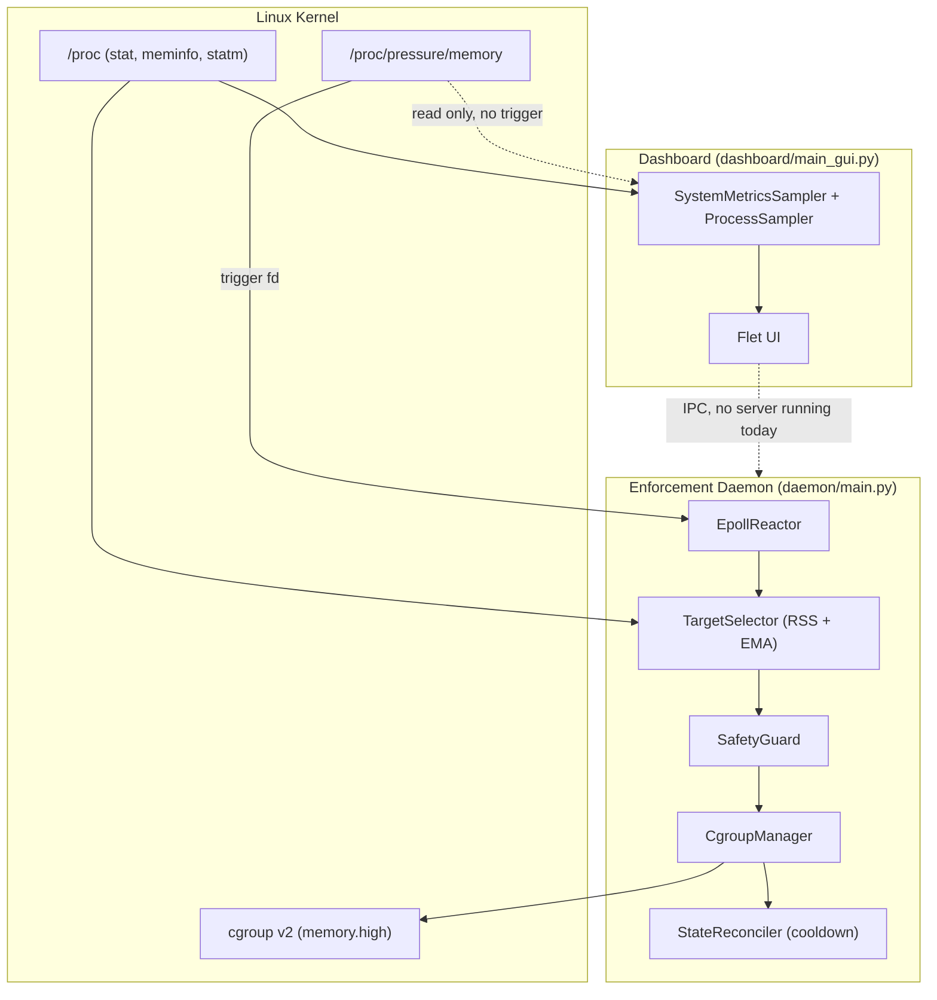

<div align="center">

# SENTRY

### Keep Linux responsive under heavy workloads.

**SENTRY watches Linux Pressure Stall Information (PSI) and cgroup v2 to catch memory
contention before it turns into a sluggish desktop or a stalled build.**

[](https://kernel.org)
[](https://python.org)
[](https://docs.kernel.org/admin-guide/cgroup-v2.html)
[](https://www.kernel.org/doc/html/latest/accounting/psi.html)
[](LICENSE)

**Experimental • Linux-first • PSI-driven • Open Source**

[Quick Start](#quick-start) •
[Project Status](#project-status) •
[Architecture](#architecture) •
[Known Limitations](#known-limitations) •
[Roadmap](#roadmap) •
[Contributing](#contributing)

</div>

---

## Why SENTRY?

Anyone who has run a heavy build, a container image pull, or a local model-training job
on a workstation has seen this:

- A `docker build` slowly eats memory until everything else grinds to a halt.
- `make -j$(nproc)` turns the browser into a slideshow.
- A background sync job quietly stalls interactive applications.
- The system "feels" slow while `top` insists CPU usage is unremarkable.

CPU and memory *utilization* answer "how busy is the machine?" They don't answer "is
work actually waiting?" Linux has an answer to that second question: **Pressure Stall
Information (PSI)**, exposed since kernel 4.20 under `/proc/pressure/`. PSI reports how
much time tasks spend stalled on CPU, memory, or I/O — the thing users actually feel as
lag.

SENTRY's enforcement daemon subscribes to a kernel-level PSI trigger for memory stalls
and reacts by throttling the largest memory consumer via a **cgroup v2 `memory.high`**
limit, then reverts the limit once the process has cooled down. A separate dashboard
process visualizes CPU, memory, I/O, and PSI in real time. Today these two pieces run
**independently** — see [Architecture](#architecture) for exactly how they fit together
and what is not yet wired up.

---

## Project Status

SENTRY is a young, experimental project (`v0.x`). It has one working enforcement path
and a larger amount of supporting code that is implemented and unit-tested but **not
yet connected** to that enforcement path. This table is a direct reflection of the
current source tree, not of design intent:

| Component | Status | Notes |
|---|---|---|
| PSI trigger + epoll reactor (`core/collectors/`) | ✅ Implemented | Blocks on kernel PSI events, no polling |
| Memory mitigation via `memory.high` (`core/cgroup_manager.py`) | ✅ Implemented | The only cgroup control the running daemon applies |
| Target selection by RSS + EMA smoothing (`engine/selector.py`) | ✅ Implemented | Selects the single largest memory consumer |
| Critical-process protection (`core/safety_guard.py`) | ✅ Implemented | Hardcoded, not user-configurable by design |
| Cooldown + PID-recycling guard (`engine/reconciliation.py`) | ✅ Implemented | 60s cooldown, hardcoded in `daemon/main.py` |
| systemd `sd_notify` integration | ✅ Implemented | `READY=1`, `WATCHDOG=1`, `STOPPING=1` |
| PSI + utilization blended pressure scoring (`engine/pressure.py`) | ✅ Implemented, unit-tested | Not consumed by the enforcement daemon today |
| Flet dashboard (`dashboard/main_gui.py`) | ✅ Implemented | Runs standalone against local `/proc`, see limitations |
| YAML configuration (`sentry_config.yaml`, `core/config.py`) | ⚠️ Parsed & tested, not loaded at runtime | Neither daemon nor dashboard calls `core/runtime.py::init_runtime()` |
| IPC server/client (`core/ipc.py`) | ⚠️ Implemented, unit-tested, never started | No process instantiates `IpcServer` outside of tests |
| Observe-only / Armed / Dry-run modes | ⚠️ Schema exists, not enforced | Fields exist on `DaemonState`; the daemon does not check them |
| CPU / I/O cgroup control (`core/cgroups.py`) | ⚠️ Implemented, unused | Not called from any running entry point |
| Workload classifier (`engine/classifier.py`) | ⚠️ Implemented, unit-tested, unused | Not consulted during target selection |
| Feedback / outcome evaluation (`engine/feedback.py`) | ⚠️ Implemented, partially tested | Not invoked after a mitigation is released |
| CLI client | 📅 Planned | Not present in this repository |
| Prometheus exporter | 📅 Planned | Not present in this repository |

> **Current release:** experimental `v0.x`. The code that runs today enforces a single
> policy — throttle the largest memory consumer when the kernel reports a memory stall
> — everything else described above is either observability-only or scaffolding for
> future work. See [Known Limitations](#known-limitations) before deploying anywhere
> that matters.

---

## Quick Start

### Requirements

- Linux with cgroup v2 (unified hierarchy) mounted at `/sys/fs/cgroup`
- Kernel ≥ 4.20 booted with PSI enabled (`psi=1` if not on by default)
- Python 3.8+
- Root privileges (or `CAP_SYS_RESOURCE`) to open PSI trigger files and write cgroup
  limits

Verify your system supports what SENTRY needs:

```bash
mount | grep cgroup2
cat /proc/pressure/memory
```

If either command fails, the enforcement daemon will refuse to start — it fails fast
rather than degrading silently.

### Install

```bash
git clone https://github.com/apexajay-rc/SENTRY.git
cd SENTRY

python3 -m venv .venv
source .venv/bin/activate

pip install -r requirements.txt
```

### Run the enforcement daemon

The daemon is a package, not a standalone script — invoke it as a module from the
repository root so `core` and `engine` resolve correctly:

```bash
sudo .venv/bin/python3 -m daemon.main
```

Running `python daemon/main.py` directly will fail with `ModuleNotFoundError: No
module named 'core'`, since the working directory is not on `sys.path` in that mode.

### Run the dashboard

```bash
python3 dashboard/main_gui.py
```

The dashboard requires `flet` (`pip install -r requirements.txt` already installs it).
It works with or without the daemon running — see
[Dashboard vs. daemon](#dashboard-vs-daemon) below.

### Run the tests

```bash
python3 -m unittest discover -s tests -v
```

At the time of writing this suite has 39 collected tests, 2 known failures, and 1
import error (`tests/test_selector.py` references a class name that no longer exists
in `engine/selector.py`). This is a real, current state of the repository — not a
hypothetical — and is tracked in [Known Limitations](#known-limitations).

---

## Architecture

SENTRY today is two independent Python processes that share a codebase but not a
runtime. They are not started together, and they do not talk to each other by default.



### What the daemon actually does

1. Opens a kernel PSI trigger on `/proc/pressure/memory` for a `some` stall exceeding
   500ms within a 1-second window, and registers the resulting file descriptor with an
   `epoll` reactor (`core/collectors/epoll_events.py`).
2. When the kernel fires that trigger, `TargetSelector` scans `/proc/[pid]/statm` for
   every running process, applies an exponential moving average (α = 0.4) to smooth
   transient spikes, and returns the PID with the highest smoothed RSS.
3. `SafetyGuard` rejects the target if it is PID ≤ 1, a kernel thread, SENTRY's own
   process, or on a hardcoded list of critical daemons (`systemd`, `sshd`,
   `dbus-daemon`, `bash`, `tmux`, and similar).
4. If the target passes, `CgroupManager` resolves its cgroup v2 path from
   `/proc/[pid]/cgroup` and writes a `memory.high` limit (hardcoded at `500M` in
   `daemon/main.py`).
5. `StateReconciler` records the PID, cgroup path, and timestamp. Every event-loop tick
   (kernel event, or a 5-second timeout, whichever comes first) it checks for entries
   older than a 60-second cooldown and releases them — but only if the process is still
   in the same cgroup it was throttled in, guarding against PID reuse.
6. On `SIGTERM`/`SIGINT`, all active throttles are released immediately before the
   process exits.

This loop does not read CPU or I/O pressure, does not apply CPU or I/O cgroup limits,
does not consult `sentry_config.yaml`, and does not expose its state over IPC.

### Dashboard vs. daemon

The dashboard is a **separate, standalone observability tool**. On each 2-second tick
it attempts to ping an IPC server; since the daemon above never starts one, that ping
always fails today, and the dashboard falls back to sampling `/proc` directly using
`core/metrics.py` and `core/process.py`. It computes its own blended
utilization/PSI stress score (`engine/pressure.py`), classifies it into
LOW/MODERATE/HIGH/CRITICAL using thresholds in `core/policy.py`, and renders CPU,
memory, I/O, PSI, a stress sparkline, and the top three processes by a 70% CPU / 30%
memory weighted score.

The dashboard's **Mode**, **Armed**, **Observe-only**, and **Dry-run** controls send
commands through `core/ipc.py`'s `IpcClient` — but since no process instantiates
`IpcServer` outside of the test suite, these controls currently have no effect on
system behavior. They are wired for a daemon-with-IPC that doesn't exist in this
release.

---

## Safety Model

The parts of the safety model that are live in the running enforcement daemon:

**Critical process protection.** `SafetyGuard` maintains a hardcoded (intentionally
non-configurable) set of infrastructure binaries — `systemd`, `init`, `sshd`,
`dbus-daemon`, `dbus-broker`, `systemd-journald`, `systemd-udevd`, `systemd-logind`,
`bash`, `tmux`, `screen` — plus PID 1, kernel threads (PPID 2), and SENTRY's own
process. If SENTRY cannot read a process's name at all, it fails safe and treats the
process as protected rather than risking a false negative.

**Cooldown and reversal.** Every throttle is tracked with the exact cgroup path it was
applied to. Nothing is released until a fixed cooldown has elapsed, and even then only
if the target process is still resident in the same cgroup — preventing a recycled PID
from inheriting someone else's throttle removal.

**Reversibility on shutdown.** `SIGTERM`/`SIGINT` triggers an immediate, unconditional
release of every tracked `memory.high` limit before the process exits, so a crashed or
stopped daemon does not leave a process permanently throttled.

**PSI and cgroup v2 preflight checks.** Both `PsiMonitor` and `CgroupManager` verify
kernel support at startup (`/proc/pressure` and `cgroup.controllers` respectively) and
raise immediately if the running kernel doesn't support what SENTRY needs, instead of
silently degrading.

What the safety model does **not** currently do — see
[Known Limitations](#known-limitations):

- There is no live **observe-only**, **dry-run**, or **armed** switch. The daemon
  mitigates unconditionally whenever the PSI trigger fires and a valid target is found.
- There is no configurable critical-process list at runtime; `sentry_config.yaml`'s
  `critical_processes` section is parsed by `ConfigManager` but never read by the
  running daemon.

---

## Configuration

`sentry_config.yaml` defines a complete schema — daemon timing, stress thresholds, a
CPU/memory/I/O escalation matrix, metric weights, cgroup path, a critical-process list,
and logging targets. `core/config.py::ConfigManager` loads, merges, and validates it,
and is exercised by the test suite.

```yaml
thresholds:
  low: 0.35
  moderate: 0.50
  high: 0.70
  critical: 0.85

metrics:
  cpu_weight: 0.35
  memory_weight: 0.25
  io_weight: 0.15
  psi_blend: 0.40

critical_processes:
  - systemd
  - gnome-shell
  - Xorg
```

**This file is not yet consumed by anything you can run.** `core/runtime.py` defines
`init_runtime()`, which is the only code path that wires `ConfigManager` into
`core/policy.py` and `core/metrics.py` — and nothing in `daemon/main.py` or
`dashboard/main_gui.py` calls it. Today, editing `sentry_config.yaml` has no effect on
either running process. Treat it as a forward-looking schema, validated by tests, and
tracked on the [roadmap](#roadmap) to be wired into the actual entry points.

---

## Repository Structure

```text
SENTRY/
├── daemon/
│   ├── main.py                  # The enforcement daemon entry point (run as -m daemon.main)
│   └── systemd_integration.py   # sd_notify READY/WATCHDOG/STOPPING support
│
├── core/
│   ├── collectors/
│   │   ├── epoll_events.py      # epoll reactor used by the daemon
│   │   ├── psi.py               # kernel PSI trigger management (used by the daemon)
│   │   ├── procfs.py            # simple polling CPU/mem/swap reader (used by collector_test.py)
│   │   └── processes.py         # psutil-based process listing (used by collector_test.py)
│   ├── cgroup_manager.py        # per-PID cgroup resolution + memory.high (used by the daemon)
│   ├── cgroups.py                # generic single-path cgroup control incl. CPU weight (unused today)
│   ├── safety_guard.py          # critical-process protection (used by the daemon)
│   ├── config.py                # YAML config loader (tested, not wired to any entry point)
│   ├── policy.py                # threshold/escalation classification (used by dashboard's classifier)
│   ├── classifier.py             # stress + trend classification (used by dashboard)
│   ├── metrics.py                # utilization + PSI blended scoring (used by dashboard)
│   ├── process.py                # per-process CPU/mem sampling (used by dashboard)
│   ├── procfs.py                 # /proc parsing primitives (used by dashboard + metrics)
│   ├── ipc.py                    # Unix/TCP IPC server & client (tested, never started)
│   ├── actions.py                # renice-based priority reduction helper (unused)
│   ├── action_tracker.py         # action bookkeeping dataclass (unused)
│   ├── logging.py                # structured JSON audit logger (unused)
│   ├── runtime.py                # config bootstrap (defined, never invoked)
│   └── platform_adapter.py / platform/linux.py  # cross-platform metric shims (used by dashboard)
│
├── engine/
│   ├── selector.py               # RSS + EMA target selection (used by the daemon)
│   ├── reconciliation.py         # cooldown + PID-recycling guard (used by the daemon)
│   ├── timeseries.py             # EMA smoothing primitive (used by selector.py)
│   ├── pressure.py               # utilization/PSI blended pressure engine (used by dashboard)
│   ├── classifier.py             # workload classification (tested, unused by daemon or dashboard)
│   └── feedback.py               # mitigation outcome evaluation (tested, unused)
│
├── model/
│   ├── pressure.py                # PSI/utilization/pressure dataclasses
│   ├── candidate.py                # MitigationCandidate dataclass (unused)
│   └── action_outcome.py           # ActionOutcome dataclass (duplicated by engine/feedback.py)
│
├── dashboard/
│   └── main_gui.py                 # standalone Flet observability UI
│
├── tests/
│   ├── test_*.py                   # unittest suite (discoverable via `unittest discover`)
│   ├── collector_test.py           # ad hoc script; not picked up by discovery, imports a
│   │                                # function that no longer exists in core/collectors/psi.py
│   └── fixtures/proc/              # mock /proc data used by procfs-parsing tests
│
├── sentry_config.yaml              # full configuration schema (see note above)
├── requirements.txt
└── LICENSE
```

---

## Known Limitations

This section exists because the [Development Philosophy](#development-philosophy)
below is worth nothing if the README hides what doesn't work yet. As of this revision:

- **The daemon and the dashboard do not talk to each other.** No process starts
  `core/ipc.py`'s `IpcServer` outside of the test suite, so the dashboard's Mode,
  Armed, Observe-only, and Dry-run controls have no effect on the running daemon.
- **There is no dry-run or observe-only mode in the enforcement daemon itself.** It
  mitigates unconditionally when a PSI event fires and a valid, unprotected target
  exists.
- **`sentry_config.yaml` is not loaded at runtime.** All thresholds, weights, and
  limits used by the daemon and dashboard are Python defaults; `core/runtime.py`'s
  `init_runtime()` is the only code that would wire the YAML file in, and nothing
  calls it.
- **CPU and I/O pressure are not mitigated.** The daemon only reacts to memory PSI and
  only applies `memory.high`. `core/cgroups.py` has CPU-weight and I/O-weight helpers,
  but they are not called from any running entry point.
- **The workload classifier and feedback engine are not in the decision loop.**
  `engine/classifier.py` and `engine/feedback.py` are implemented and unit-tested in
  isolation but are not consulted by `TargetSelector` or invoked after a mitigation is
  released.
- **The test suite has known failures.** Running `python3 -m unittest discover -s
  tests -v` currently produces 2 failing tests
  (`test_feedback.TestFeedbackEngine.test_failed_action_no_improvement`,
  `test_metrics.ClassifierTests.test_classify_stress_by_mode`) and 1 import error
  (`tests/test_selector.py` imports `MitigationSelector`, a name that does not exist in
  `engine/selector.py`; the real class is `TargetSelector`).
- **`tests/collector_test.py` is not part of the discoverable suite** (it doesn't
  follow the `test_*.py` naming convention) and would itself fail on import — it calls
  `core.collectors.psi.collect_psi`, which does not exist in the current
  `PsiMonitor`-based implementation.

None of this makes SENTRY unusable for its one working path — memory-pressure
mitigation via the daemon — but it does mean the dashboard, the YAML configuration, and
several supporting engines are currently **documentation and scaffolding for future
work**, not active behavior. Treat the [Project Status](#project-status) table as the
source of truth.

---

## Comparison with Related Linux Tools

| Capability | htop | earlyoom | systemd-oomd | SENTRY |
|---|---|---|---|---|
| Live CPU/memory display | ✅ | ❌ | Limited | ✅ (dashboard, standalone) |
| Uses PSI | ❌ | ✅ | ✅ | ✅ (daemon: memory only) |
| Reversible mitigation | ❌ | ❌ (kills processes) | Partial (kills processes) | ✅ (`memory.high`, released on cooldown) |
| CPU pressure response | ❌ | ❌ | ❌ | 📅 Planned |
| Process kill as a mitigation | ❌ | ✅ | ✅ | ❌ (SENTRY never kills processes) |
| Runtime policy configuration | N/A | Config file | systemd unit properties | ⚠️ Schema exists, not yet loaded |

SENTRY is not a replacement for `earlyoom` or `systemd-oomd` — both of those act at the
point of near-OOM exhaustion, typically by killing a process. SENTRY intervenes earlier
and non-destructively, trading a hard guarantee (memory is freed) for a softer one
(the heaviest consumer is throttled, not terminated). It complements rather than
replaces kernel-level OOM handling.

---

## Use Cases

SENTRY's daemon is useful today anywhere unattended, memory-heavy background work
threatens interactive responsiveness:

- Development workstations running Docker builds, IDEs, and browsers side by side
- Homelabs running multiple containers or a media server alongside interactive use
- Local AI/ML workloads (dataset loading, batch inference) sharing a machine with a
  desktop session

Its dashboard is useful independently, as a lightweight PSI-aware `/proc` visualizer,
even on machines where you don't want the enforcement daemon running.

---

## Who Should Use SENTRY

- Linux desktop and workstation users hitting memory-pressure-driven slowdowns
- Systems programmers and PSI/cgroup v2 enthusiasts who want to read straightforward,
  well-commented reference code
- Contributors interested in finishing the integration work described in
  [Known Limitations](#known-limitations)

## Who Should NOT Use SENTRY

- Anyone needing CPU or I/O pressure mitigation today — it isn't implemented yet
- Production or mission-critical systems — this is a `v0.x` project with a known-failing
  test suite and hardcoded runtime limits
- Anyone who needs the dashboard's Armed/Observe-only/Dry-run switches to actually gate
  daemon behavior — they don't, yet

---

## Roadmap

### Near term
- [ ] Wire `core/runtime.py::init_runtime()` into `daemon/main.py` so
      `sentry_config.yaml` actually governs runtime behavior
- [ ] Start `IpcServer` inside the daemon so the dashboard's controls take effect
- [ ] Implement daemon-side observe-only / dry-run / armed enforcement
- [ ] Fix the three known test failures/errors listed in
      [Known Limitations](#known-limitations)
- [ ] Rename or remove `tests/collector_test.py` so `unittest discover` doesn't need a
      manual exception

### Medium term
- [ ] CPU and I/O PSI triggers alongside the existing memory trigger
- [ ] CPU-weight and I/O-weight mitigation via `core/cgroups.py`
- [ ] Wire `engine/classifier.py` workload classification into target selection
- [ ] Wire `engine/feedback.py` outcome evaluation into the reconciliation loop
- [ ] Structured JSON audit logging (`core/logging.py`) in the running daemon
- [ ] CLI client built on the existing `core/ipc.py` protocol

### Long term
- [ ] Packaged systemd unit and distro packaging
- [ ] Prometheus-compatible metrics exporter
- [ ] Benchmark suite with published, reproducible overhead numbers

This roadmap reflects intended direction, not committed delivery dates.

---

## Contributing

Contributions are welcome, and given the current state of the repository there is
unusually concrete, well-scoped work available — most of it is listed verbatim in
[Known Limitations](#known-limitations) and [Roadmap](#roadmap).

Good places to start:

- Fix `tests/test_selector.py` (`MitigationSelector` → `TargetSelector`) or update
  `engine/selector.py` if the rename should go the other way
- Fix the two failing tests in `test_feedback.py` and `test_metrics.py`
- Wire `core/runtime.py::init_runtime()` into `daemon/main.py`

Please keep pull requests focused, include a clear description of the problem being
solved, and run `python3 -m unittest discover -s tests -v` before submitting so any new
failures are visible in your PR description rather than discovered later.

---

## Development Philosophy

- The kernel provides mechanisms (PSI, cgroup v2); SENTRY provides policy.
- Prefer reversible actions over destructive ones — SENTRY throttles, it does not kill.
- Fail fast and loudly when a required kernel feature is missing, rather than degrading
  silently.
- Keep policy decisions in userspace and out of hardcoded kernel behavior.
- Document what is actually wired up, not what is architecturally possible.

---

## References

| Topic | Documentation |
|---|---|
| cgroup v2 | https://docs.kernel.org/admin-guide/cgroup-v2.html |
| Pressure Stall Information | https://www.kernel.org/doc/html/latest/accounting/psi.html |
| proc(5) | https://man7.org/linux/man-pages/man5/proc.5.html |
| sd_notify | https://www.freedesktop.org/software/systemd/man/latest/sd_notify.html |
| Flet | https://flet.dev |

---

## License

SENTRY is released under the MIT License. See [LICENSE](LICENSE) for details.

---

<div align="center">

If SENTRY's approach to PSI-driven mitigation is useful to you, a ⭐ is appreciated —
and if you can help close the gap between what's documented above as scaffolding and
what's actually wired up, a pull request is even better.

Made by **[@apexajay-rc](https://github.com/apexajay-rc)**

</div>
