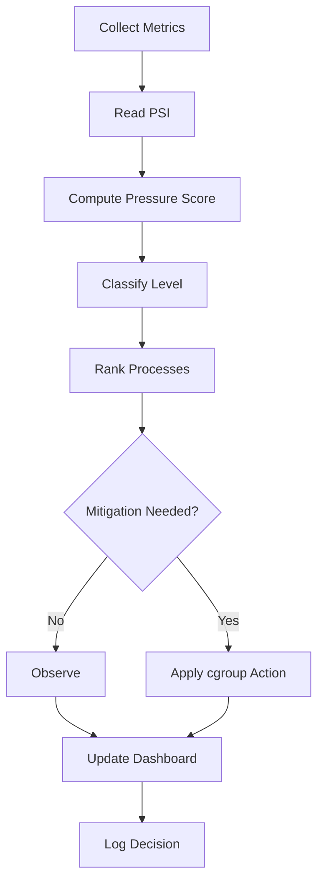

<div align="center">

# SENTRY

### Keep Linux Responsive Under Heavy Workloads.

**SENTRY is an experimental Linux daemon that detects resource pressure using Linux Pressure Stall Information (PSI) and automatically applies reversible cgroup v2 controls before your system becomes sluggish.**

> **Observe → Understand → Mitigate → Verify**

[](https://kernel.org)
[
](https://python.org)
[](https://docs.kernel.org/admin-guide/cgroup-v2.html)
[](https://www.kernel.org/doc/html/latest/accounting/psi.html)
[](LICENSE)

---

**Experimental • Linux-first • Pressure-aware • Open Source**

[Quick Start](#quick-start) •
[Features](#features) •
[Architecture](#architecture) •
[Roadmap](#roadmap) •
[Contributing](#contributing)

</div>

---

# Why SENTRY?

Have you ever experienced one of these?

- 🐳 A Docker build freezes your desktop.
- ⚙️ `make -j32` makes your browser unusable.
- 🤖 AI training causes mouse lag.
- 📦 Background jobs starve interactive applications.
- 💻 CPU utilization looks "fine" but the machine still feels slow.

Traditional monitoring tools tell you **how busy** the system is.

SENTRY asks a different question:

> **"Which workloads are making useful work wait?"**

That difference matters.

Modern Linux exposes **Pressure Stall Information (PSI)**—a kernel signal that measures **how long work is waiting for CPU, memory or I/O resources.**

Waiting is what users experience as:

- Lag
- Stuttering
- Freezes
- Poor responsiveness

Instead of reacting after the system becomes unusable, SENTRY continuously watches pressure signals and applies **safe, reversible** cgroup controls before resource contention becomes severe.

---

# What Makes SENTRY Different?

Most tools focus on observation.

SENTRY focuses on **decision making.**

```text
Traditional Monitor

CPU ↑

↓

Display Graph

↓

Human decides

↓

Human fixes problem
```

SENTRY

```text
Observe

↓

Understand

↓

Choose safest action

↓

Apply reversible mitigation

↓

Verify recovery
```

The long-term vision is a daemon that continuously protects Linux responsiveness with minimal user intervention.

---

# Project Status

| Component | Status |
|------------|---------|
| Metrics Collection | ✅ Stable |
| PSI Integration | ✅ Stable |
| Process Ranking | ✅ Stable |
| Dashboard | ✅ Stable |
| CPU Mitigation (cgroup v2) | ✅ Functional |
| Memory / IO Mitigation | 🚧 In Progress |
| Prediction Engine | 🚧 Planned |
| Feedback Learning | 📅 Planned |

> **Current Release:** Experimental (`v0.x`)
>
> SENTRY is suitable for experimentation, benchmarking and community feedback.
>
> It is **not yet recommended for production environments.**

---

# Quick Start

## Requirements

- Linux
- Python 3.8+
- cgroup v2 enabled
- Root privileges for live mitigation

Verify cgroup v2:

```bash
mount | grep cgroup2
```

Clone the repository

```bash
git clone https://github.com/apexajay-rc/SENTRY.git

cd SENTRY
```

Create a virtual environment

```bash
python3 -m venv .venv

source .venv/bin/activate
```

Install dependencies

```bash
pip install -r requirements.txt
```

Start the daemon

```bash
sudo python daemon/main.py
```

Launch the dashboard

```bash
python dashboard/main_gui.py
```

Run tests

```bash
python -m unittest discover -s tests -v
```

---

# Demo

> **Coming soon**

The repository will include a demonstration showing:

```
Without SENTRY

stress-ng

↓

Desktop becomes sluggish

────────────────────────────

With SENTRY

stress-ng

↓

PSI rises

↓

SENTRY detects contention

↓

cgroup mitigation applied

↓

Desktop remains responsive
```

---

# Why PSI Instead of CPU Usage?

CPU utilization answers:

> **"How busy is the CPU?"**

Pressure Stall Information answers:

> **"How long is useful work waiting?"**

Those are fundamentally different questions.

For example:

| Situation | CPU Usage | User Experience |
|------------|-----------|----------------|
| Idle machine | 5% | Responsive |
| Video rendering | 100% | Still responsive |
| Heavy compilation | 85% | Browser freezes |
| Memory thrashing | 35% | Nearly unusable |

CPU usage alone cannot distinguish these cases.

PSI measures actual resource contention, allowing SENTRY to respond to **user-visible slowdowns** rather than utilization alone.

---

# Comparison

| Capability | htop | earlyoom | systemd-oomd | SENTRY |
|------------|------|-----------|---------------|---------|
| Live CPU & Memory Monitoring | ✅ | ❌ | Limited | ✅ |
| Uses PSI | ❌ | ✅ | ✅ | ✅ |
| CPU Pressure Awareness | ❌ | ❌ | ❌ | ✅ |
| Automatic Mitigation | ❌ | Process Kill | Memory-based | Reversible cgroup control |
| Dashboard | ❌ | ❌ | ❌ | ✅ |
| Process Ranking | Limited | ❌ | ❌ | ✅ |
| Reversible Actions | ❌ | ❌ | ❌ | ✅ |
| Open Architecture | ❌ | Limited | Limited | ✅ |

> SENTRY is **not a replacement** for these tools.
>
> It complements existing Linux infrastructure by acting as a pressure-aware decision engine built around PSI and cgroup v2.

---

# Core Philosophy

SENTRY follows one simple principle:

> **Protect responsiveness before users notice degradation.**

Its first instinct is **not** to kill processes.

Instead it:

1. Observes the system.
2. Identifies contention.
3. Chooses the least intrusive mitigation.
4. Verifies whether the action helped.
5. Learns from future improvements.
---

# Features

SENTRY is designed around one idea:

> **Observe less. Understand more. Act safely.**

Instead of collecting metrics for humans to interpret, SENTRY continuously analyzes system pressure and decides whether intervention is necessary.

## Current Features

### Linux-native Metrics Collection

- Delta-based CPU utilization from `/proc/stat`
- Memory utilization from `/proc/meminfo`
- I/O wait monitoring
- Linux Pressure Stall Information (PSI)
- Per-process CPU accounting
- Per-process memory accounting
- Process ranking based on weighted resource contribution

---

### Pressure-Aware Scoring

SENTRY combines traditional utilization metrics with Linux PSI.

Unlike conventional monitoring tools, high utilization alone does not trigger action.

Instead, SENTRY asks:

- Is work actually stalling?
- Is pressure increasing?
- Is intervention necessary?

This significantly reduces unnecessary mitigation.

---

### Policy Engine

Pressure is classified into four operating states.

| Level | Meaning |
|--------|----------|
| LOW | Healthy |
| MODERATE | Early contention detected |
| HIGH | Sustained resource pressure |
| CRITICAL | Immediate intervention recommended |

Policies determine:

- when mitigation is allowed
- mitigation intensity
- cooldown duration
- protected workloads
- safety constraints

---

### Safe Mitigation

Current mitigation uses Linux **cgroup v2**.

Supported today:

- CPU weight adjustment (`cpu.weight`)

Planned:

- Memory protection (`memory.high`)
- Memory limits (`memory.max`)
- IO control
- CPU affinity
- Scheduler hints

Every action is designed to be **reversible**.

---

### Dashboard

The Flet dashboard provides live visibility into:

- CPU
- Memory
- I/O
- PSI
- Stress score
- Pressure level
- Selected target
- Applied mitigation
- Trend
- Top processes

Runtime controls include:

- Observe-only mode
- Armed mode
- Dry-run mode

---

### IPC

SENTRY exposes daemon state through IPC.

Supported transports:

- Unix Domain Socket
- TCP (development)

The dashboard consumes the daemon state through this interface.

Future CLI tools will use the same API.

---

### Configuration

Everything important is configurable.

Examples:

- polling interval
- pressure thresholds
- metric weights
- PSI blend ratio
- cooldown duration
- protected processes
- cgroup behavior

No source-code modification is required for tuning.

---

# How SENTRY Works

At a high level:

```text
Linux Kernel

↓

/proc + PSI

↓

SENTRY

↓

Policy Engine

↓

cgroup v2

↓

Linux Scheduler
```

Every iteration follows the same lifecycle.

```text
Observe

↓

Measure

↓

Score

↓

Classify

↓

Select Process

↓

Choose Action

↓

Apply Mitigation

↓

Verify

↓

Repeat
```

This loop runs continuously while minimizing overhead.

---

# Internal Architecture

```mermaid
flowchart LR

A[/proc/stat]

B[/proc/meminfo]

C[/proc/pressure]

D[/proc/[pid]/stat]

A --> Metrics
B --> Metrics
C --> Metrics
D --> ProcessSampler

Metrics --> PressureEngine
ProcessSampler --> PressureEngine

PressureEngine --> Policy

Policy --> Mitigation

Mitigation --> Cgroups

Mitigation --> Dashboard

Dashboard <-->|IPC| Daemon
```

---

# Repository Structure

```text
SENTRY/

├── daemon/
│   └── Main daemon lifecycle
│
├── core/
│   ├── Metrics
│   ├── Policy
│   ├── IPC
│   ├── Process sampling
│   ├── cgroup interface
│   └── Runtime
│
├── model/
│   ├── Pressure models
│   └── Domain objects
│
├── engine/
│   ├── Pressure engine
│   └── Future prediction engines
│
├── dashboard/
│   └── Flet dashboard
│
├── tests/
│   ├── Unit tests
│   └── Mock /proc fixtures
│
├── docs/
│
└── sentry_config.yaml
```

---

# Pressure Engine

Traditional monitoring computes utilization.

SENTRY computes **pressure**.

The scoring pipeline:

```text
CPU %

Memory %

IO Wait %

↓

Utilization Score

+

PSI

↓

Pressure Score

↓

Policy Decision
```

Current pressure calculation:

```text
Utilization Score

=

CPU Weight × CPU

+

Memory Weight × Memory

+

IO Weight × IO Wait
```

```text
PSI Score

=

CPU PSI

+

Memory PSI

+

IO PSI
```

```text
Pressure Score

=

(1 − Blend)

×

Utilization

+

Blend

×

PSI
```

The blend ratio is configurable.

If PSI is unavailable, SENTRY automatically falls back to utilization scoring.

---

# Process Ranking

When mitigation becomes necessary, SENTRY identifies workloads contributing most to resource contention.

Each process receives a weighted score.

```text
Process Score

=

70%

CPU Contribution

+

30%

Memory Contribution
```

Processes are ranked from highest to lowest.

Protected processes are automatically excluded.

The highest eligible process becomes the mitigation candidate.

---

# Safety Model

SENTRY is intentionally conservative.

Resource control should never surprise the user.

## Observe-only

No kernel writes occur.

All decisions are logged.

Perfect for validation and benchmarking.

---

## Armed Mode

Mitigation is disabled until explicitly armed.

This prevents accidental intervention.

---

## Dry-run

Shows exactly what SENTRY would do without modifying cgroups.

Useful during development.

---

## Critical Process Protection

Important services are never selected.

Examples include:

- init
- systemd
- sshd
- SENTRY itself

The denylist is configurable.

---

## Cooldowns

Repeated mitigation on the same workload is avoided.

Each process enters a configurable cooldown after intervention.

This prevents oscillation.

---

## Platform Guards

Linux:

✅ Monitoring

✅ PSI

✅ cgroups

Windows:

Monitoring only.

No resource control.

---

# Runtime Decision Flow

Every polling cycle follows this sequence.



---

> **Design Principle**
>
> SENTRY always prefers the least intrusive action capable of restoring responsiveness.
>
> Resource control is incremental, reversible, and guided by kernel signals rather than fixed utilization thresholds.
> ---

# Configuration

SENTRY is configured through `sentry_config.yaml`.

Nearly every runtime behavior can be customized without modifying source code.

Supported configuration includes:

- Polling interval
- Pressure thresholds
- CPU / Memory / I/O metric weights
- PSI blend ratio
- Cooldown duration
- Protected processes
- cgroup behavior
- Observe-only mode
- Dry-run mode

Example:

```yaml
metrics:
  cpu_weight: 0.35
  memory_weight: 0.25
  io_weight: 0.15

  psi_cpu_weight: 0.10
  psi_memory_weight: 0.10
  psi_io_weight: 0.05

  psi_blend: 0.40
```

Policy configuration:

```yaml
policy:

  low: 0.35

  moderate: 0.50

  high: 0.70

  critical: 0.85
```

Current mitigation policy:

| Level | Default Action |
|---------|----------------|
| LOW | Monitor |
| MODERATE | CPU Weight = 50 |
| HIGH | CPU Weight = 30 |
| CRITICAL | CPU Weight = 10 |

---

# Example Runtime Output

Typical daemon output:

```text
CPU=42%

MEM=58%

IO=2%

Stress=0.47

Util=0.31

PsiScore=0.71

Level=MODERATE

Trend=Rising

Target=build-worker (PID 4821)

Action=Observe only

PSI_CPU=11.8

PSI_MEM=3.9

PSI_IO=0.6
```

After enabling mitigation:

```text
Action=cgroup throttle applied

PID=4821

cpu.weight=50
```

Every action is logged for later inspection.

---

# Performance

The project aims to remain lightweight.

Current benchmark status:

| Metric | Status |
|---------|--------|
| CPU overhead | 📅 To be measured |
| Memory footprint | 📅 To be measured |
| Detection latency | 📅 To be measured |
| Mitigation latency | 📅 To be measured |
| Maximum tested processes | 📅 To be measured |

Future releases will publish reproducible benchmark results and methodology.

---

# Use Cases

SENTRY is designed for workloads where maintaining system responsiveness matters.

Examples include:

### Development Workstations

- Large software compilation
- Docker builds
- Containerized development
- IDE responsiveness

---

### AI & Data Science

- Local model training
- Dataset preprocessing
- Background inference
- Mixed interactive workloads

---

### Homelabs

- Multiple containers
- Backup jobs
- Media servers
- Virtual machines

---

### Performance Research

- PSI experimentation
- Resource contention analysis
- Linux scheduler studies
- cgroup policy evaluation

---

# Who Should Use SENTRY?

SENTRY is a good fit if you are:

- Linux desktop users
- Systems programmers
- Kernel enthusiasts
- DevOps engineers
- Platform engineers
- Homelab operators
- Open-source contributors
- Performance researchers

---

# Who Should NOT Use SENTRY?

At its current stage, SENTRY is **not** intended for:

- Mission-critical production clusters
- Safety-critical infrastructure
- Systems requiring long-term support guarantees
- Environments where experimental software cannot be deployed

The project is still evolving and APIs may change before a stable 1.0 release.

---

# Roadmap

## v0.x — Foundation

- [x] `/proc` metrics
- [x] PSI integration
- [x] Pressure scoring
- [x] Process ranking
- [x] CPU mitigation via cgroup v2
- [x] Dashboard
- [x] IPC

---

## Near Term

- [ ] Memory cgroup support
- [ ] I/O cgroup support
- [ ] Structured logging
- [ ] Graceful daemon shutdown
- [ ] CLI client
- [ ] Packaging
- [ ] Systemd service

---

## Medium Term

- [ ] Workload classification
- [ ] Foreground application protection
- [ ] Trend prediction
- [ ] Action verification engine
- [ ] Benchmark suite
- [ ] Prometheus metrics

---

## Long Term

- [ ] GPU telemetry
- [ ] GPU-aware scheduling policies
- [ ] Feedback-driven policy tuning
- [ ] Plugin architecture
- [ ] Distributed agents
- [ ] Cluster-aware resource management

The roadmap reflects project direction rather than guaranteed delivery dates.

---

# Contributing

Contributions are welcome.

Whether you're fixing bugs, improving documentation, or experimenting with new scheduling policies, your help is appreciated.

You can contribute by:

- Reporting bugs
- Suggesting features
- Improving documentation
- Writing tests
- Benchmarking SENTRY
- Reviewing code
- Submitting pull requests

If you're looking for somewhere to start, check issues labeled:

- `good first issue`
- `help wanted`
- `documentation`
- `enhancement`

Please keep pull requests focused and include a clear explanation of the problem being solved.

---

# Development Principles

SENTRY follows a few core principles:

- Linux-first
- Pressure-aware rather than utilization-aware
- Safe by default
- Reversible actions
- Configuration over hardcoding
- Kernel mechanisms, userspace policy
- Simple architecture over unnecessary complexity

---

# Inspiration

SENTRY builds upon capabilities provided by the Linux kernel rather than replacing them.

Key technologies include:

- Linux Pressure Stall Information (PSI)
- cgroup v2
- `/proc`
- Unix Domain Sockets
- Python
- Flet

---

# References

| Topic | Documentation |
|--------|---------------|
| cgroup v2 | https://docs.kernel.org/admin-guide/cgroup-v2.html |
| Pressure Stall Information | https://www.kernel.org/doc/html/latest/accounting/psi.html |
| proc(5) | https://man7.org/linux/man-pages/man5/proc.5.html |
| Flet | https://flet.dev |

---

# License

SENTRY is released under the MIT License.

See the `LICENSE` file for details.

---

# Acknowledgements

SENTRY exists because Linux exposes powerful building blocks such as PSI, cgroup v2, and `/proc`.

Rather than reinventing resource management, SENTRY aims to orchestrate these kernel mechanisms into a practical, pressure-aware userspace daemon.

---

<div align="center">

## Star the Project

If SENTRY helped you, taught you something, or you believe in its direction, consider giving the repository a ⭐.

Bug reports, benchmark results, feature ideas, and pull requests are all welcome.

**Kernel signals. Intelligent decisions. Reversible control. Responsive Linux.**

Made with ❤️ by **[@apexajay-rc](https://github.com/apexajay-rc)**

</div>
