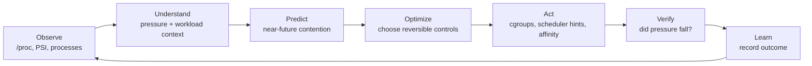
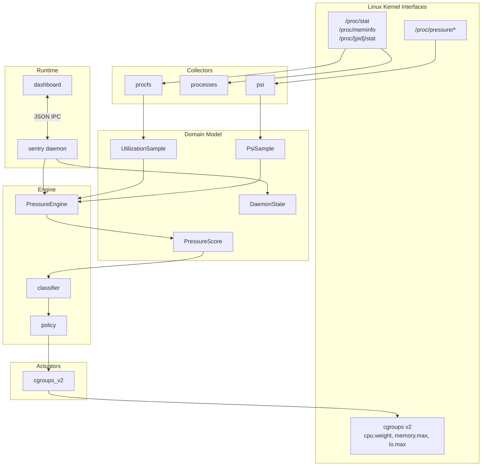
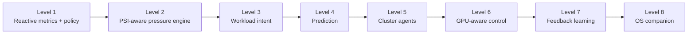

<div align="center">

# SENTRY

### Pressure-Aware Resource Orchestration for Linux

**SENTRY preserves responsiveness under contention.**

It watches kernel pressure, understands which workloads matter, applies reversible controls, and verifies whether the system actually recovered.

<br>

[](https://kernel.org)
[](https://python.org)
[](https://docs.kernel.org/admin-guide/cgroup-v2.html)
[](https://www.kernel.org/doc/html/latest/accounting/psi.html)
[](LICENSE)

<br>

[Why SENTRY](#why-sentry) |
[Architecture](#architecture) |
[Pressure Engine](#pressure-engine) |
[Quick Start](#quick-start) |
[Roadmap](#roadmap)

</div>

---

## Why SENTRY

Most system monitors answer a simple question:

```text
How busy is the machine?
```

SENTRY is built around a better question:

```text
Which workloads are stalling, what is causing it, and what action preserves performance?
```

High CPU is not always a problem. Low CPU is not always health. A desktop can feel frozen before utilization looks dramatic. A database can miss latency targets while averages still look fine. A GPU training job can idle because the CPU data pipeline is under pressure.

SENTRY treats **pressure** as the primary signal.

```text
Utilization says: "The resource is used."
Pressure says:    "Work is waiting."
```

---

## The Loop



Current SENTRY implements the first production slice of this loop:

```text
Metrics -> Pressure scoring -> Policy -> Reversible action
```

The goal is larger:

```text
Observe -> Understand -> Predict -> Optimize -> Verify -> Learn
```

---

## What It Does Today

SENTRY currently provides:

- Delta-based CPU and I/O wait sampling from `/proc/stat`
- Memory pressure context from `/proc/meminfo`
- Linux PSI reads from `/proc/pressure/{cpu,memory,io}`
- Per-process CPU scoring from `/proc/[pid]/stat`
- Configurable PSI-aware pressure scoring
- Policy tiers: `LOW`, `MODERATE`, `HIGH`, `CRITICAL`
- Safe cgroup v2 CPU throttling through `cpu.weight`
- Critical-process protection
- Observe-only, armed, and dry-run modes
- Daemon/dashboard IPC over Unix socket or TCP
- Flet dashboard with live system state and control switches
- Mocked `/proc` fixtures for tests

SENTRY does **not** kill processes by default. Its first instinct is reversible pressure shaping.

---

## Architecture



Repository layout:

```text
SENTRY/
|-- core/                  # Existing runtime, collectors, IPC, policy, cgroups
|-- model/                 # Canonical resource and pressure models
|-- engine/                # Pressure-first scoring and future decision engines
|-- daemon/                # Long-running control loop
|-- dashboard/             # Flet real-time dashboard
|-- tests/                 # Unit tests and mocked /proc fixtures
|-- sentry_config.yaml     # Thresholds, metric weights, cgroup settings
`-- requirements.txt
```

---

## Pressure Engine

SENTRY blends utilization context with PSI stall signals.

```text
utilization_score =
  cpu_weight * cpu%
  + memory_weight * memory%
  + io_weight * io_wait%

psi_score =
  weighted(cpu_psi_some_avg10, memory_psi_some_avg10, io_psi_some_avg10)

pressure_score =
  (1 - psi_blend) * utilization_score
  + psi_blend * psi_score
```

When PSI is unavailable, SENTRY falls back to utilization scoring.

The scoring contract now lives in:

- `model/pressure.py`
- `engine/pressure.py`
- `core/metrics.py`

This is the first step toward making SENTRY pressure-first instead of monitor-first.

---

## Safety Model

SENTRY is deliberately conservative.

| Safety gate | Default | Why it matters |
|---|---:|---|
| Observe-only mode | On | Lets you inspect decisions before control |
| Armed mode | Off | Mitigation must be explicitly enabled |
| Dry-run mode | Off | Can log intended actions without writing cgroups |
| Critical process denylist | On | Protects system services and SENTRY itself |
| Per-PID cooldown | 15s | Prevents repeated hammering of the same target |
| Platform guard | On | Windows/dev mode remains monitor-only |

Action ladder:

```text
observe
dry-run decision
cgroup cpu.weight adjustment
future: io.weight
future: memory.high / memory.max
future: scheduler and affinity hints
future: GPU-aware placement and throttling
```

---

## Quick Start

### Requirements

- Linux, preferably with cgroups v2 enabled
- Python 3.8+
- Root/sudo for live cgroup writes

Check cgroups v2:

```bash
mount | grep cgroup2
```

Install:

```bash
git clone https://github.com/apexajay-rc/SENTRY.git
cd SENTRY
python3 -m venv venv
source venv/bin/activate
pip install -r requirements.txt
```

Run:

```bash
# Terminal 1: daemon
sudo python daemon/main.py

# Terminal 2: dashboard
python dashboard/main_gui.py
```

Run tests:

```bash
python -m unittest discover -s tests -v
```

---

## Configuration

`sentry_config.yaml` controls polling, thresholds, pressure weights, cgroup behavior, cooldowns, and protected process names.

Example pressure weights:

```yaml
metrics:
  cpu_weight: 0.35
  memory_weight: 0.25
  io_weight: 0.15
  psi_cpu_weight: 0.10
  psi_memory_weight: 0.10
  psi_io_weight: 0.05
  psi_blend: 0.40
```

Example policy tiers:

| Level | Score | Current response |
|---|---:|---|
| `LOW` | `< 0.35` | Monitor |
| `MODERATE` | `>= 0.50` | CPU weight 50 |
| `HIGH` | `>= 0.70` | CPU weight 30 |
| `CRITICAL` | `>= 0.85` | CPU weight 10 |

---

## Example Decision

```text
CPU=45% | MEM=62% | IO=3%
Stress=0.48 | Util=0.32 | PsiScore=0.72
Level=MODERATE | Trend=Rising
Target=build-worker(1234)
Action=Observe only (mitigation disabled)
PSI_CPU=12.3 | PSI_MEM=4.1 | PSI_IO=0.8
```

After arming and disabling observe-only:

```text
Action=cgroup throttle applied (PID 1234, cpu_weight=50)
```

---

## Roadmap



Near-term:

- [x] Read CPU, memory, and I/O PSI
- [x] Blend PSI into pressure scoring
- [x] Introduce `model/` and `engine/` layers
- [ ] Move collectors into a dedicated `collectors/` package
- [ ] Add workload identity and protection rules
- [ ] Add structured decision logs
- [ ] Apply memory and I/O cgroup actions

Medium-term:

- [ ] Foreground workload protection
- [ ] Workload classifier for games, browsers, compilers, databases, containers, and AI jobs
- [ ] Prediction engine using pressure trends and growth rates
- [ ] Verification loop for action outcomes
- [ ] Benchmark harness against baseline, earlyoom, and systemd-oomd-style behavior

Long-term:

- [ ] GPU telemetry through NVML and ROCm
- [ ] GPU-aware workload placement and protection
- [ ] Node-agent/control-plane split
- [ ] Cluster pressure scoring and lightweight scheduling
- [ ] Feedback-driven policy adaptation
- [ ] Prometheus metrics export

---

## Design Direction

The ultimate SENTRY is not a monitor. It is a pressure-aware resource control plane.

```text
It should know:

What workloads are doing
Why they are doing it
What pressure is forming
What pressure will form
Which action is safest
Whether the action worked
What to do better next time
```

The destination:

```text
A pressure-aware distributed resource orchestration platform that continuously
learns workload behavior and dynamically optimizes CPU, memory, storage,
network, and accelerator allocation while preserving service guarantees.
```

---

## References

| Topic | Documentation |
|---|---|
| cgroups v2 | [kernel.org/admin-guide/cgroup-v2](https://docs.kernel.org/admin-guide/cgroup-v2.html) |
| PSI | [kernel.org/accounting/psi](https://www.kernel.org/doc/html/latest/accounting/psi.html) |
| `/proc` filesystem | [man proc(5)](https://man7.org/linux/man-pages/man5/proc.5.html) |
| Flet UI | [flet.dev](https://flet.dev/) |

---

<div align="center">

**Built by [@apexajay-rc](https://github.com/apexajay-rc)**

*Kernel signals. Reversible controls. Performance preserved under pressure.*

MIT License

</div>
