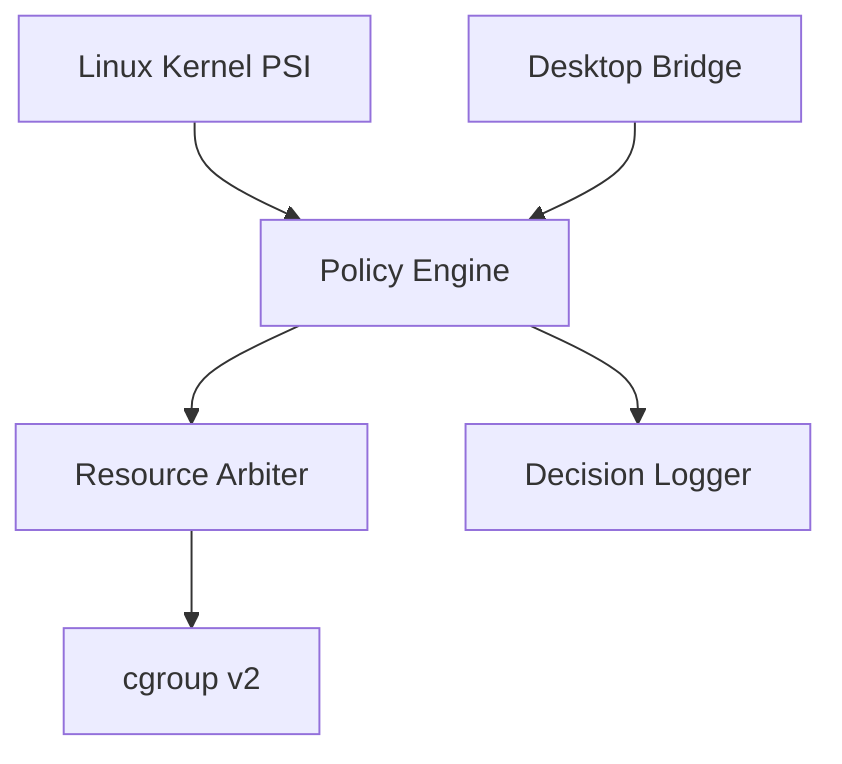
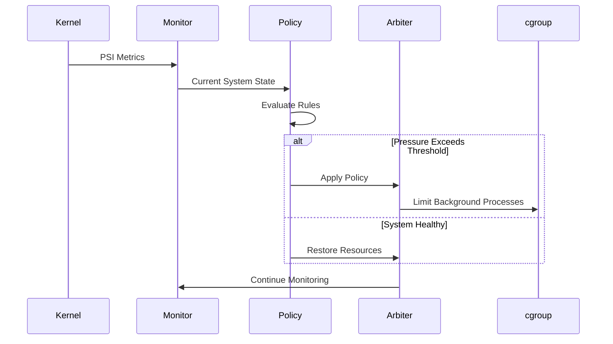

<div align="center">

<pre>
███████╗███████╗███╗   ██╗████████╗██████╗ ██╗   ██╗
██╔════╝██╔════╝████╗  ██║╚══██╔══╝██╔══██╗╚██╗ ██╔╝
███████╗█████╗  ██╔██╗ ██║   ██║   ██████╔╝ ╚████╔╝
╚════██║██╔══╝  ██║╚██╗██║   ██║   ██╔══██╗  ╚██╔╝
███████║███████╗██║ ╚████║   ██║   ██║  ██║   ██║
╚══════╝╚══════╝╚═╝  ╚═══╝   ╚═╝   ╚═╝  ╚═╝   ╚═╝
</pre>


# SENTRY

### Policy-Driven Linux Resource Arbitration for Interactive Workloads

**Observe • Evaluate • Protect • Recover**

<br>


</div>

---

> **SENTRY** is a Linux userspace daemon that preserves desktop responsiveness during CPU and memory contention by combining **Linux Pressure Stall Information (PSI)**, **foreground workload awareness**, and **cgroup v2** resource controls. Instead of terminating processes, SENTRY applies **temporary, policy-driven resource constraints** to competing background workloads and automatically restores them when system pressure subsides.

---

## Why SENTRY?

Traditional Linux resource management answers one question:

> **Which process consumes the most resources?**

SENTRY answers a different one:

> **Which workload should remain responsive right now?**

Rather than relying solely on CPU utilization or reacting only after memory exhaustion, SENTRY continuously evaluates system pressure, active user context, and configurable policies before making resource arbitration decisions.

<div align="center">

| Traditional Resource Management | SENTRY |
|:-------------------------------:|:------:|
| Resource-centric | User-centric |
| Reactive | Proactive |
| Kill or terminate | Temporary resource constraints |
| CPU & memory usage | PSI + foreground awareness |
| Static behavior | Policy-driven arbitration |
| Emergency response | Continuous monitoring |

</div>

---

## Philosophy

SENTRY follows four principles that guide every design decision.

| Principle | Description |
|------------|-------------|
| **Observe** | Continuously monitor Linux PSI and desktop activity. |
| **Evaluate** | Combine kernel telemetry, foreground state, and policy rules before taking action. |
| **Protect** | Preserve the responsiveness of interactive workloads using reversible resource controls. |
| **Recover** | Automatically restore constrained workloads once resource pressure subsides. |

---

> [!NOTE]
>
> ### Why a Meerkat?
>
> In a meerkat colony, a sentry stands upright and continuously watches the surroundings while the rest of the colony works. It does not fight every threat—it observes, detects danger early, and alerts the colony when intervention is needed.
>
> SENTRY follows the same philosophy.
>
> Rather than reacting after the desktop becomes unresponsive, it continuously monitors Linux resource pressure, detects contention early, protects interactive workloads, and restores normal operation automatically.

---

## Table of Contents

- [Features](#features)
- [Architecture](#architecture)
- [Quick Start](#quick-start)
- [Configuration](#configuration)
- [Monitoring Dashboard](#monitoring-dashboard)
- [Security Model](#security-model)
- [Performance](#performance)
- [Roadmap](#roadmap)
- [Contributing](#contributing)
- [License](#license)

## Why SENTRY?

Modern Linux systems are excellent at maximizing throughput, but throughput and responsiveness are not always the same thing.

During heavy CPU or memory contention, interactive applications such as browsers, IDEs, terminals, and video calls can become sluggish even though the system remains technically operational.

Traditional approaches typically react only after severe contention has already occurred by terminating processes, invoking the OOM Killer, or relying solely on scheduler heuristics.

SENTRY takes a different approach.

Instead of asking:

> *Which process is consuming the most resources?*

SENTRY asks:

> *Which workload should remain responsive right now?*

By continuously observing Linux Pressure Stall Information (PSI), identifying foreground workloads, and applying temporary policy-driven cgroup controls to competing background processes, SENTRY preserves desktop responsiveness without terminating applications.

When pressure subsides, all restrictions are automatically removed.

## Features

| Feature | Description |
|----------|-------------|
| **Linux PSI Monitoring** | Continuously observes CPU, memory, and I/O pressure using the Linux PSI interface. |
| **Foreground Awareness** | Detects the actively used desktop application and prioritizes its responsiveness. |
| **Policy Engine** | Makes enforcement decisions based on configurable resource policies instead of static thresholds. |
| **cgroup v2 Enforcement** | Applies temporary CPU and memory constraints to selected workloads. |
| **Automatic Recovery** | Restores constrained processes once resource pressure returns to normal. |
| **Decision Logging** | Records every policy decision for debugging and auditability. |
| **Desktop Integration** | Designed specifically for interactive Linux desktop environments. |
| **Safe-by-Default** | Uses reversible controls instead of forcefully terminating applications. |

## Architecture


### Linux PSI Monitor

Collects real-time CPU, memory, and I/O pressure metrics directly from the Linux kernel.

---

### Desktop Bridge

Determines which application currently owns user focus.

---

### Policy Engine

Combines kernel pressure, desktop state, cooldown timers, and administrator-defined policies to determine whether intervention is required.

---

### Resource Arbiter

Applies reversible cgroup v2 constraints to selected workloads.

---

### Decision Logger

Produces structured logs describing every observation and enforcement action.

---

# Repository Layout

```text
SENTRY/
│
├── assets/
│   ├── banner.svg
│   ├── logo/
│   │   ├── sentry-meerkat.png
│   │   └── icon.svg
│   └── screenshots/
│
├── config/
│   └── sentry.yaml
│
├── docs/
│   ├── architecture.md
│   ├── internals.md
│   ├── policy-engine.md
│   └── benchmarks.md
│
├── logs/
│
├── src/
│   ├── monitor.py
│   ├── policy_engine.py
│   ├── desktop_bridge.py
│   ├── cgroup_manager.py
│   ├── logger.py
│   └── main.py
│
├── tests/
│
├── LICENSE
├── Makefile
├── README.md
└── requirements.txt
```

### Directory Overview

| Directory | Purpose |
|-----------|---------|
| **assets/** | Project branding, screenshots, diagrams, and documentation resources. |
| **config/** | Runtime configuration and policy definitions. |
| **docs/** | Detailed technical documentation and design notes. |
| **logs/** | Runtime decision logs and debugging output. |
| **src/** | Core implementation of SENTRY. |
| **tests/** | Unit and integration tests. |

## Core Components

| Module | Responsibility |
|---------|----------------|
| **monitor.py** | Reads Linux Pressure Stall Information (PSI) metrics. |
| **desktop_bridge.py** | Detects the active desktop application and user focus. |
| **policy_engine.py** | Evaluates system state and determines enforcement actions. |
| **cgroup_manager.py** | Applies and removes temporary cgroup v2 resource limits. |
| **logger.py** | Records structured observations and policy decisions. |
| **main.py** | Coordinates monitoring, policy evaluation, and enforcement. |

## How SENTRY Works



## Enforcement Lifecycle

```text
              Observe
                 │
                 ▼
         Collect PSI Metrics
                 │
                 ▼
      Evaluate Resource Policies
                 │
         ┌───────┴────────┐
         │                │
         ▼                ▼
   Pressure Low     Pressure High
         │                │
         ▼                ▼
 Continue Monitor   Apply cgroup Limits
         │                │
         └───────┬────────┘
                 ▼
       Verify Responsiveness
                 │
                 ▼
      Restore Original State
                 │
                 ▼
            Repeat
```

## Design Goals

SENTRY is designed around five core engineering objectives.

| Goal | Description |
|------|-------------|
| **Predictability** | Decisions should be deterministic and policy-driven. |
| **Reversibility** | Every enforcement action must be automatically reversible. |
| **Observability** | Every significant event should be logged and explainable. |
| **Safety** | Never terminate workloads when temporary resource controls are sufficient. |
| **Low Overhead** | Continuous monitoring should introduce minimal CPU and memory overhead. |

## Why Not Just Use the OOM Killer?

The Linux Out-Of-Memory (OOM) Killer is designed to recover from catastrophic memory exhaustion by terminating processes. While effective as a last resort, it operates only after the system has entered a critical state.

SENTRY addresses a different problem.

By observing Linux Pressure Stall Information (PSI) and proactively applying temporary cgroup v2 resource controls, SENTRY aims to preserve responsiveness before the system reaches emergency conditions. Rather than replacing kernel mechanisms such as the scheduler or OOM Killer, SENTRY complements them by acting earlier in the resource contention lifecycle.

---

# Quick Start

## Prerequisites

Before running SENTRY, ensure your system meets the following requirements.

| Requirement | Version |
|------------|---------|
| Linux Kernel | 5.10+ (PSI support required) |
| Python | 3.11 or newer |
| cgroup | v2 |
| Distribution | Ubuntu 22.04+, Fedora 39+, Arch Linux (recommended) |
| Privileges | sudo (required for resource enforcement) |

---

## Installation

Clone the repository.

```bash
git clone https://github.com/<your-username>/SENTRY.git
cd SENTRY
```

Create a virtual environment.

```bash
python3 -m venv .venv
source .venv/bin/activate
```

Install dependencies.

```bash
pip install -r requirements.txt
```

Verify PSI support.

```bash
cat /proc/pressure/cpu
cat /proc/pressure/memory
```

If these files exist, your kernel supports Linux Pressure Stall Information.

---

## Running SENTRY

Start the daemon.

```bash
sudo python3 src/main.py
```

Example output:

```text
[INFO] Initializing SENTRY...

[INFO] Loading configuration...

[INFO] Linux PSI available.

[INFO] Desktop bridge initialized.

[INFO] Monitoring started.

[INFO] Waiting for resource pressure...
```

---

## Running in Observe Mode

Observe Mode records system pressure without enforcing resource limits.

```bash
sudo python3 src/main.py --observe
```

This mode is useful for:

- Validating PSI collection
- Testing policy thresholds
- Benchmarking
- Demonstrating system behavior

---

## Example Enforcement

```text
CPU Pressure Detected

Foreground:
Firefox (PID 4321)

Background:
stress-ng (PID 8765)

Action:
Applied cpu.max = 40%

Reason:
CPU PSI exceeded configured threshold.

Status:
Foreground responsiveness preserved.
```

---

## Automatic Recovery

Once pressure returns below configured thresholds:

```text
Pressure normalized.

Removing CPU limits...

Restoring original cgroup configuration...

Recovery complete.
```

---

# Configuration

SENTRY behavior is controlled through `config/sentry.yaml`.

```yaml
psi:
  cpu_threshold: 0.75
  memory_threshold: 0.60

policy:
  cooldown: 30
  recovery_delay: 15

desktop:
  prioritize_foreground: true

logging:
  level: INFO
```

---

## Configuration Parameters

| Parameter | Description |
|-----------|-------------|
| `cpu_threshold` | CPU pressure threshold before enforcement begins. |
| `memory_threshold` | Memory pressure threshold for intervention. |
| `cooldown` | Minimum time between consecutive enforcement actions. |
| `recovery_delay` | Delay before restoring constrained workloads. |
| `prioritize_foreground` | Preserve responsiveness of the active application. |
| `logging.level` | Runtime logging verbosity. |

---

# Logging

SENTRY produces structured logs describing every significant event.

Example:

```text
2026-07-28 20:11:54 INFO Monitor CPU PSI: 0.83

2026-07-28 20:11:55 INFO Policy Threshold exceeded

2026-07-28 20:11:55 INFO Enforcement Applied cpu.max=40%

2026-07-28 20:12:14 INFO Recovery Restored original limits
```

Every decision is traceable, making the daemon easier to debug and audit.

---

# Security Model

SENTRY is designed to operate with the principle of **least intervention**. Rather than terminating processes or modifying application behavior, it applies temporary and reversible Linux resource controls through cgroup v2.

## Security Principles

| Principle | Description |
|-----------|-------------|
| **Least Intervention** | Never terminate workloads unless explicitly configured. |
| **Reversible Actions** | Every enforcement action has a corresponding recovery action. |
| **Policy-Driven Decisions** | Enforcement is based on configurable policies rather than hardcoded rules. |
| **Auditability** | Every observation and enforcement action is logged. |
| **Kernel Compatibility** | Uses documented Linux kernel interfaces (PSI and cgroup v2). |

---

## What SENTRY Does

- Reads Linux Pressure Stall Information (PSI)
- Identifies the active foreground workload
- Applies temporary cgroup resource limits
- Restores workloads automatically
- Records structured decision logs

---

## What SENTRY Does Not Do

- Replace the Linux scheduler
- Disable the OOM Killer
- Modify kernel behavior
- Inject code into processes
- Kill applications by default

---

## Required Privileges

Certain operations require elevated privileges because they modify cgroup parameters.

| Operation | Privilege |
|----------|-----------|
| Read PSI metrics | User |
| Detect foreground application | User |
| Modify cgroups | Root |
| Write logs | User |

---

# Roadmap

## Current Status

- [x] Linux PSI Monitoring
- [x] Policy Engine
- [x] Desktop Awareness
- [x] cgroup v2 Enforcement
- [x] Automatic Recovery
- [x] Structured Logging

---

## Planned Features

- [ ] Adaptive policy tuning
- [ ] Multi-user awareness
- [ ] Wayland-native desktop integration
- [ ] GTK configuration utility
- [ ] Prometheus metrics exporter
- [ ] Grafana dashboard
- [ ] Plugin system
- [ ] Machine learning policy recommendations
- [ ] eBPF-assisted telemetry
- [ ] Container workload awareness

---

# Contributing

Contributions are welcome.

If you would like to contribute:

1. Fork the repository.
2. Create a feature branch.

```bash
git checkout -b feature/my-feature
```

3. Commit your changes.

```bash
git commit -m "Add my feature"
```

4. Push your branch.

```bash
git push origin feature/my-feature
```

5. Open a Pull Request.

---

## Development Guidelines

Please ensure that all contributions:

- Follow existing code style.
- Include appropriate documentation.
- Include tests where applicable.
- Preserve backward compatibility whenever possible.
- Keep enforcement logic deterministic and policy-driven.

---

# License

This project is licensed under the MIT License.

See the [LICENSE](LICENSE) file for details.
